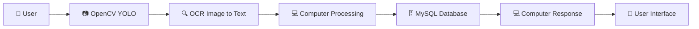

# 🚗 Parking Car WebApp Project 🅿️

### _Smart Parking Solution for the Modern World_

---

## 🎯 **ทำไมถึงมาเป็นผลงานนี้**

<blockquote>
💡 <strong>ปัญหาในปัจจุบัน:</strong> การหาที่จอดรถในพื้นที่แออัดเป็นเรื่องยากมาก ไม่สามารถนำของไปขวางได้เพราะผิดกฎหมาย ⚠️
  
🚀 <strong>วิสัยทัศน์:</strong> จึงเป็นเหตุผลที่ผมคิดจะริเริ่มการทำระบบจองที่จอดรถผ่านเว็บแอป เพื่อแก้ไขปัญหานี้
</blockquote>

---

## ⚙️ **หลักการทำงาน**

### 🔧 **เทคโนโลยีที่ใช้:**

- **🤖 OpenCV**: Object Detection สำหรับตรวจจับป้ายทะเบียน
- **🎯 YOLO**: โมเดล AI สำหรับการตรวจจับวัตถุ
- **📝 OCR**: แปลงภาพเป็นข้อความ
- **🗄️ MySQL**: ฐานข้อมูลสำหรับจัดเก็บข้อมูล
- **🌐 WebApp**: หน้าต่างผู้ใช้งาน

---

## 🎉 **ประโยชน์ที่ได้รับ**

<table>
<tr>
<td align="center">

 <strong>ความสะดวกสบาย</strong>
 ในการใช้งาน
</td>
<td align="center">

 <strong>ประหยัดเวลา</strong>
 ไม่ต้องหาที่จอดรถ
</td>
<td align="center">

 <strong>ลดความแออัด</strong>
 ในพื้นที่จอดรถ
</td>
</tr>
</table>

---

## 🚀 **สิ่งที่สามารถนำไปพัฒนาต่อยอดได้**

### 🔮 **Future Features:**

<strong>🔋 การจองที่ชาร์จรถไฟฟ้า</strong>

 
- ระบบจองสถานีชาร์จรถไฟฟ้า
- ตรวจสอบสถานะการชาร์จ
- คำนวณเวลาที่ใช้ในการชาร์จ

<strong>📍 การเช็คการมาทำงานด้วยป้ายทะเบียน</strong>

 
- ระบบ Check-in/Check-out อัตโนมัติ
- ติดตามเวลาเข้า-ออก
- รายงานการมาทำงาน

<strong>💰 การเก็บเงินจากที่จอดรถ</strong>

 
- ระบบชำระเงินออนไลน์
- คำนวณค่าจอดรถตามเวลา
- ใบเสร็จรับเงินดิจิทัล

---

### 🌟 **Made with ❤️ by Film**

---

_"Innovation is the ability to see change as an opportunity, not a threat."_

